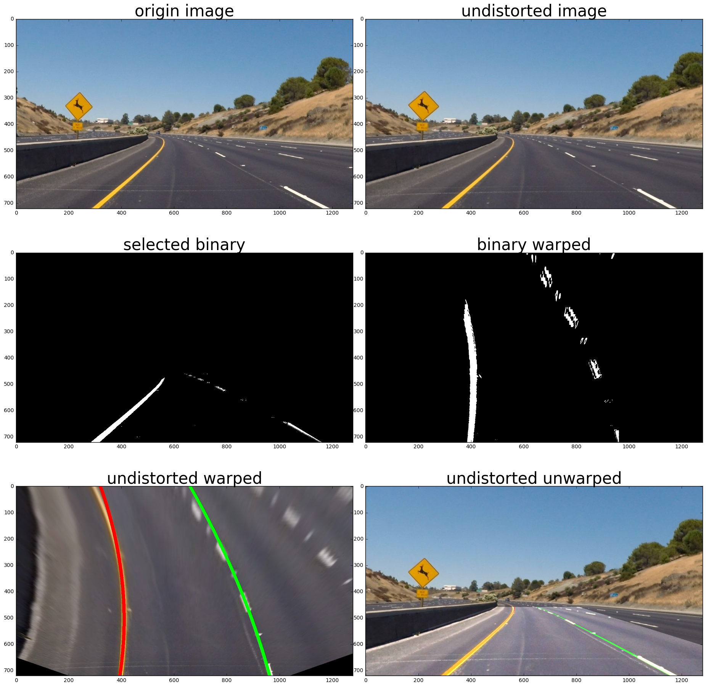

## Calculate distortion coefficients and camera matrix
To compute distortion coefficients, I iteratively find imgpoints for each provided chessboard images and corresponding objpoints first. With these points, camera matrix and distortion coefficients are computed by cv2.calibrateCamera.

```python
# Here is an example
```


    <matplotlib.image.AxesImage at 0x7fc4bac4ea90>


## Pipeline (single images)
1. The image was undistorted with camera matrix and distortion coefficients. In the second cell of P4.ipynb.
   (the result is "undistorted image" below)

2. To generate wanted binary image, yellow and white areas are picked in HSV, and Saturation channel was      used to find out possible areas that fit the threshold. 

3. These color selections were combined with horizontal gradient selection to produce a binary image. 

4. Region selection (a trapezoid) was applied to the binary image (the "selected binary" below), and transformed    it into bird-eye perspective (the result is "binary warped") with cv2.warpPerspective. The source points and 
   destination points are setted in Config class.
   
5. Find lane lines with the binary warped image. To do this, 
   a. the warped image was splitted vertically (say 25 pixels from 450 to 720, that is to say the image was           splitted into 10 pieces with size of 1280*25);
   b. applied the histogram method introduced in the course to each piece;
   c. split each piece horizontally and find out the left and right center respectively;
   d. search the points that around the left center points and right center points and fit a second order             polynomial line for left side and right side respectively,
      (the result is "undistorted warped");
   e. draw lane lines back to the undistorted image ("undistorted unwarped").
   
All these steps are combined together in function single_image_processing.

```python
"""
Here are results for a single image processing:
    origin image: the original image
    undistorted image: the result after undistortion
    selected binary: the result of color selection, gradient selection and region extraction
    binary warped: the result after applying perspective transforming to the selected binary
    undistorted warped: drawing lines to the bird-eye perspective image
    undistorted unwarped: transform back with lane lines
"""
```





## Discussion

In this project, I tried different kinds of gradient selection methed, but most of them did not give satifying results for most cases. In this pipeline, I choose to use horizontal gradients which performs relatively better than other methods. Comparatively, color selection works much better for most images. 
One drawback of relying too much on color selection is that the algorithm would probably fail when the image become too bright or too dark.
In order to tune parameters efficiently, I gather those frequently tuned parameters in a Config class so that grid search can be applied easily for further optimization.
